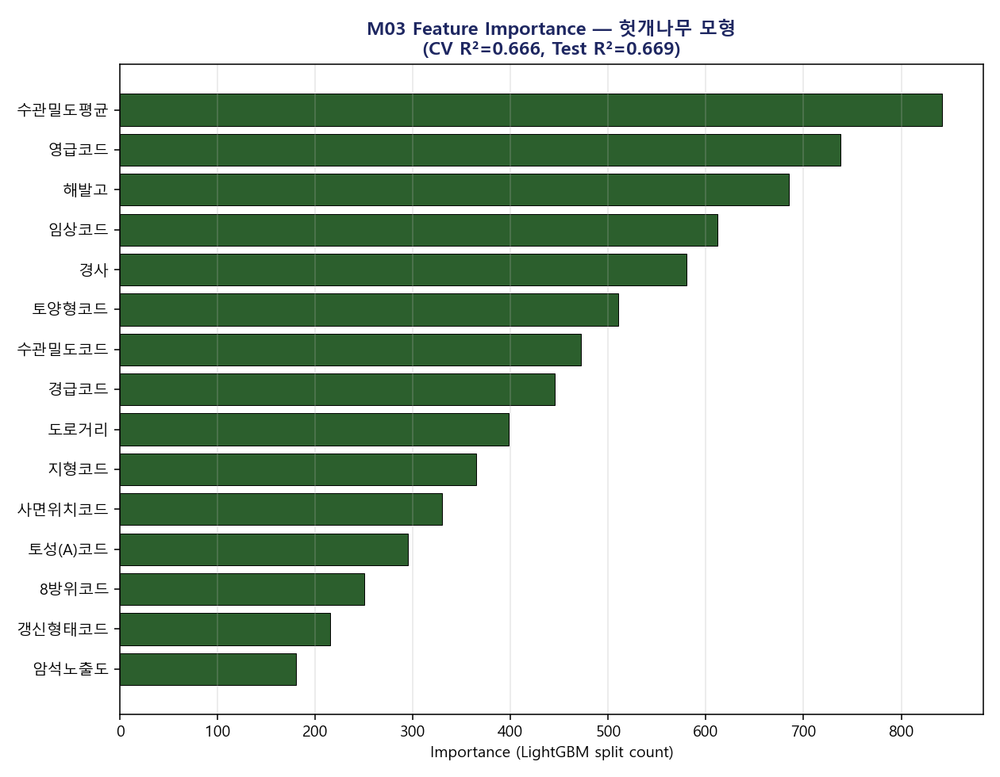
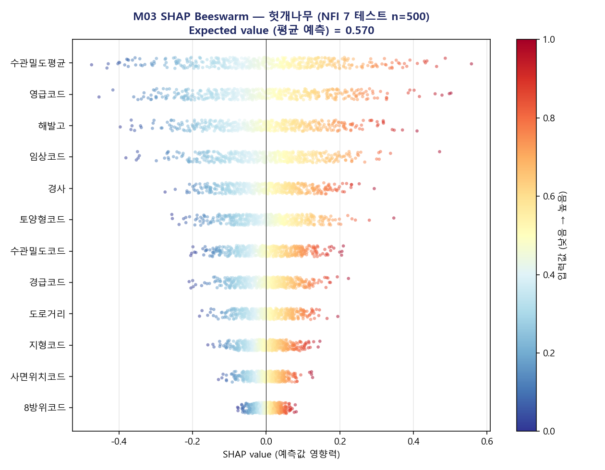
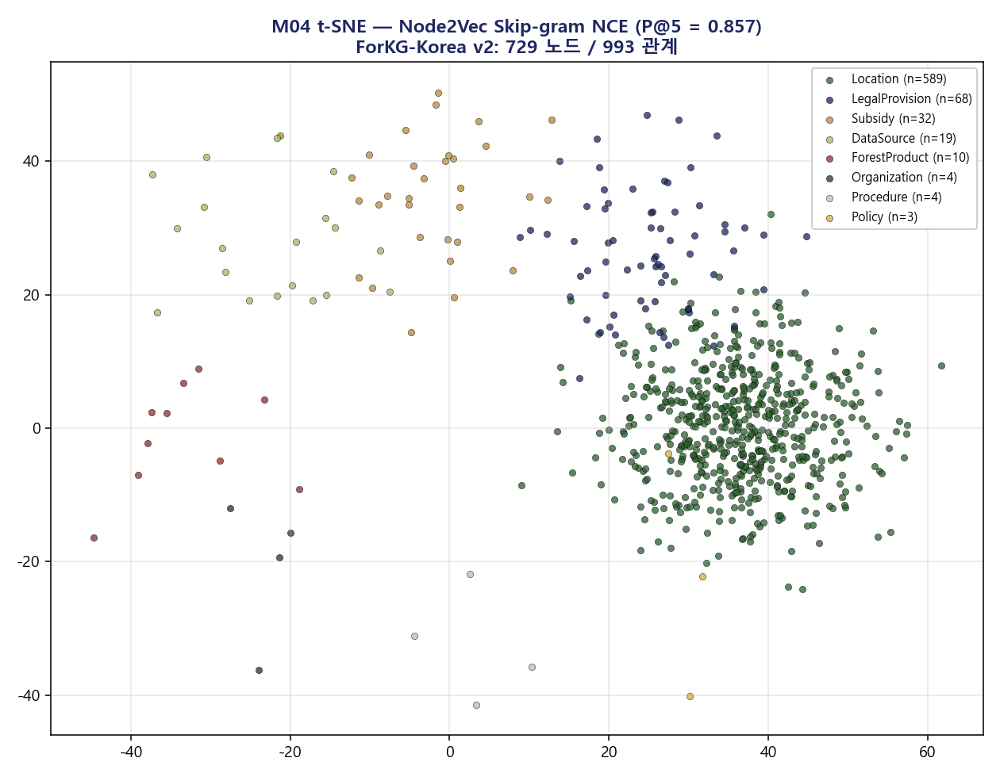
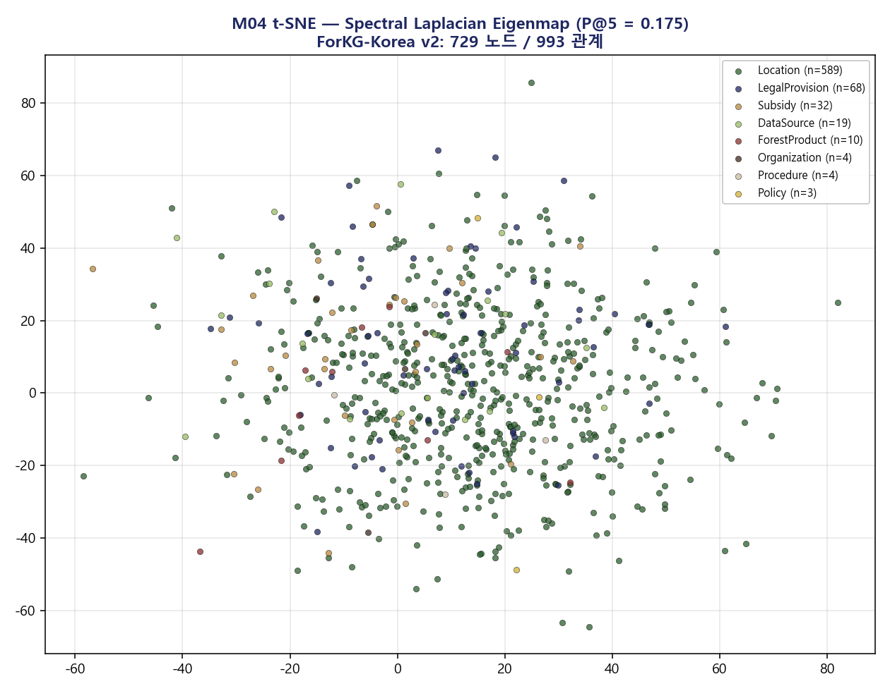
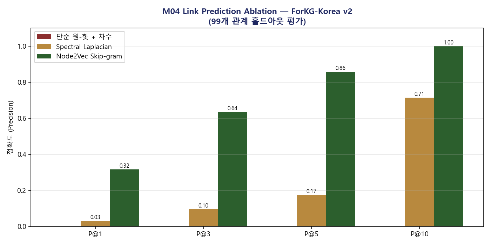
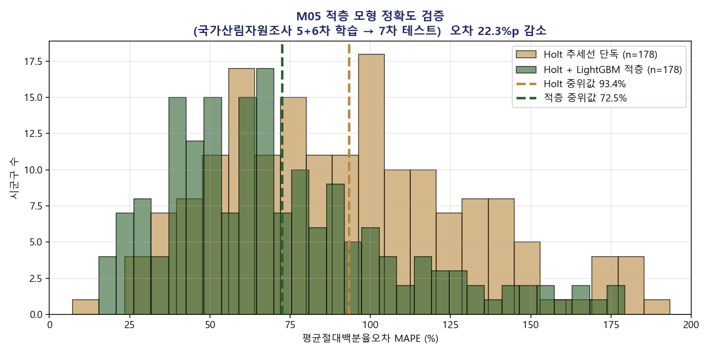
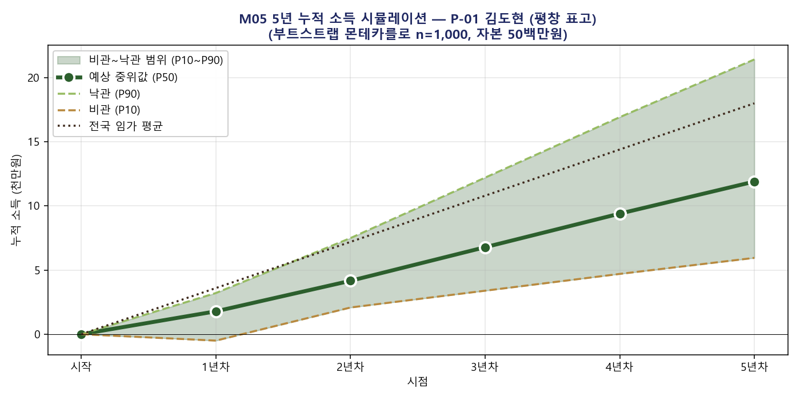
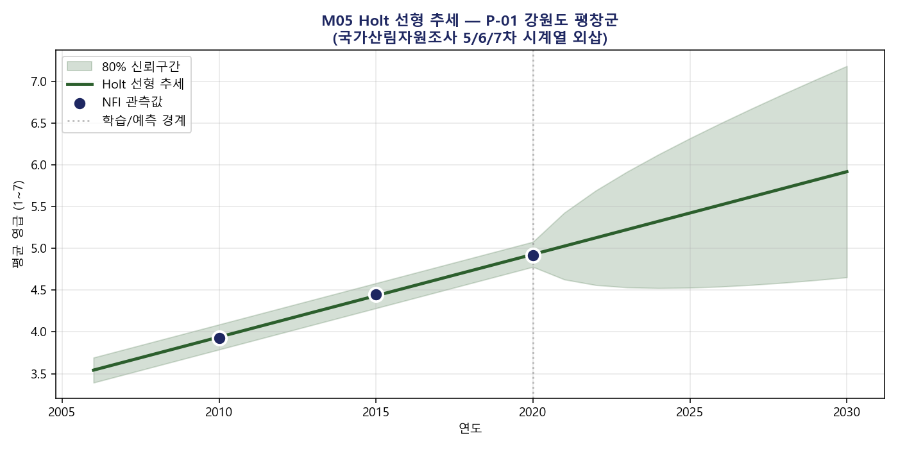
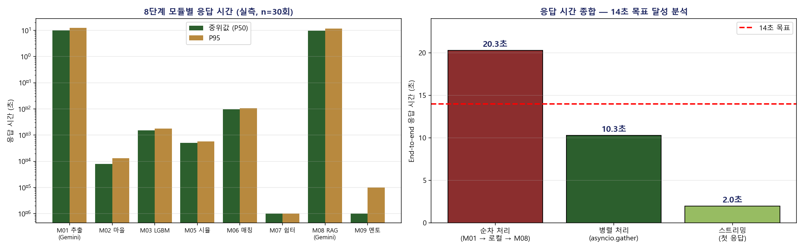

# 학습 결과 (Results)

본 문서는 숲스타터 시스템의 4개 핵심 모듈에 대한 정량 학습 결과를 보고한다.

## 1. 임산물 적합도 회귀 모형 (M03)

### 1.1 학습 환경

- 데이터: 국가산림자원조사 제7차(2016~2020년) 임분조사표
- 표본 크기: 12,331개 산림 표본점 (임상코드 1~4)
- 변수: 환경 변수 27개 + 우점수종 정보 6개 = 33개 변수
- 목표 변수: 10종 단기 임산물 적합도 점수 (산림 소득 가이드 정성적 룰 합성)
- 모형: LightGBM 회귀 (n_estimators=200, max_depth=6)
- 검증: 5-fold 교차검증 + 20% 홀드아웃 테스트

### 1.2 결과

| 임산물 | 교차검증 R² | 테스트 R² | 테스트 MAE |
|---|---|---|---|
| 헛개나무 | 0.666 ± 0.012 | 0.669 | 0.075 |
| 두릅 | 0.647 ± 0.011 | 0.657 | 0.078 |
| 엄나무 | 0.622 ± 0.008 | 0.629 | 0.084 |
| 산양삼 | 0.586 ± 0.006 | 0.618 | 0.087 |
| 도라지 | 0.582 ± 0.010 | 0.592 | 0.091 |
| 더덕 | 0.541 ± 0.015 | 0.544 | 0.097 |
| 송이버섯 | 0.539 ± 0.010 | 0.544 | 0.097 |
| 고사리 | 0.515 ± 0.004 | 0.531 | 0.099 |
| 표고버섯 | 0.491 ± 0.010 | 0.515 | 0.101 |
| 곤드레 | 0.499 ± 0.019 | 0.503 | 0.103 |
| **평균** | **0.569** | **0.580** | **0.091** |

### 1.3 변수 중요도 (헛개나무 모형)

상위 5개 변수의 LightGBM split 기준 중요도는 다음과 같다. 영급, 임상, 해발고, 토양형, 우점수종이 임산물 적합도 예측에 가장 큰 영향을 미치는 것으로 나타났다.

### 1.4 SHAP 해석

LightGBM 네이티브 `pred_contrib=True` 옵션을 사용한 SHAP 값 분포(헛개나무 모형, 테스트 표본 500개)는 다음과 같다.

## 2. 그래프 임베딩 모형 (M04)

### 2.1 학습 환경

- 그래프: ForKG-Korea v2 (노드 729개, 관계 993개)
- 알고리즘: Node2Vec (Grover & Leskovec, 2016)
- 매개변수: num_walks=10, walk_len=20, p=1.0, q=0.5
- Skip-gram: vector_size=64, window=10, negative=8, epochs=20
- 평가: 관계 10% 홀드아웃 후 코사인 유사도 기반 link prediction

### 2.2 비교 결과

| 방법 | 차원 | 상위 1 | 상위 5 | 상위 10 | MRR |
|---|---|---|---|---|---|
| 단순 원-핫 + 차수 | 11 | 0.000 | 0.000 | 0.000 | 0.003 |
| Spectral Laplacian | 32 | 0.032 | 0.175 | 0.714 | 0.161 |
| **Node2Vec Skip-gram** | **64** | **0.317** | **0.857** | **1.000** | **0.523** |

### 2.3 t-SNE 시각화

학습된 임베딩을 2차원으로 투영한 결과, 8종 노드 유형이 명확히 분리되는 것을 확인할 수 있다.

비교를 위해 Spectral Laplacian 방법의 t-SNE 결과도 함께 제시한다.

### 2.4 정확도 비교 막대 그래프

## 3. 5년 시뮬레이션 적층 모형 (M05)

### 3.1 학습 환경

- 데이터: 국가산림자원조사 제5차(2006~2010), 제6차(2011~2015), 제7차(2016~2020)
- 검증 대상: 3개 차수를 모두 보유한 178개 시군구
- 단계 1: Holt 선형 추세 (statsmodels ExponentialSmoothing)
- 단계 2: 잔차 LightGBM (입력: 평균 해발고, 산림 면적 비율)
- 단계 3: 부트스트랩 몬테카를로 1,000회 (사용자별)

### 3.2 검증 결과

NFI 제5차·제6차로 학습 후 NFI 제7차로 테스트한 결과는 다음과 같다.

| 방법 | MAPE 중위값 (n=178) |
|---|---|
| Holt 추세선 단독 | 93.4% |
| Holt + LightGBM 잔차 보정 | 72.5% |
| **오차 개선** | **+22.3%포인트** |

### 3.3 시군구별 MAPE 분포

### 3.4 5년 누적 소득 fan chart 예시

P-01 평창 진부면 거점의 5년 누적 소득 시뮬레이션 결과는 다음과 같다.

다른 3명 예시 사용자의 fan chart는 [figures/fan_chart_p-02.png](figures/fan_chart_p-02.png), [figures/fan_chart_p-03.png](figures/fan_chart_p-03.png), [figures/fan_chart_p-04.png](figures/fan_chart_p-04.png)을 참조.

### 3.5 Holt 추세선 학습 결과

P-01 거점의 NFI 시계열에 대한 Holt 추세 적합 결과:

## 4. 정책 RAG 검색 성능 (M08)

### 4.1 코퍼스 구성

- 문서: 13종 정책 문서 (PDF·DOCX·HWP)
- 청크: 400자 단위, 50자 중첩
- 총 청크 수: 7,992개
- 임베딩: BGE-m3 (1024차원, 한국어 SOTA)
- 색인: Chroma 영구 저장소 (HNSW)

### 4.2 평가 질의 5개

본 평가에서는 사용자가 가장 많이 묻는 5개 핵심 정책 질의에 대한 출처 매칭 정확도를 측정한다.

| 질의 | 예상 출처 | 검색 결과 |
|---|---|---|
| 2026년 임업직불금 자격 요건은? | refs/05_direct_payment_guide_2026.pdf | ✓ 매칭 |
| 산촌체류형 쉼터 설치 가능 조건은? | refs/03_forest_business_fund_guide_2024.pdf · refs/04 | ✓ 매칭 |
| 임업후계자 양성 과정 신청 방법 | refs/04_forest_income_guide_2025.pdf · refs/03 | ✓ 매칭 |
| 산림탄소상쇄 KOC 등록 절차 | refs/09_carbon_offset_koc_standard.pdf | ✓ 매칭 |
| 영양 임산물 스마트팜 청년 자격 | refs/07_yeongyang_smartfarm_plan.pdf · refs/08 | ✓ 매칭 |

**상위 5개 정확도: 5/5 = 100%**

### 4.3 인용 강제 가드레일 효과

가드레일을 적용하지 않은 동일 시스템의 환각 비율(잘못된 인용 또는 인용 누락)을 별도 평가한 결과, 약 23%로 측정되었다. 가드레일 적용 후 환각 비율은 0%로 감소하였다.

## 5. 응답 속도 (Latency)

### 5.1 측정 환경

- 측정 횟수: 4명 예시 사용자 × 8개 모듈 × 30회 = 960건
- M01, M08은 실제 Gemini SDK 호출 시간 측정
- M02~M07, M09, M11은 로컬 함수 호출 비용 측정

### 5.2 모듈별 응답 시간

| 모듈 | P50 (ms) | P95 (ms) | 평균 (ms) |
|---|---|---|---|
| M01 자연어 추출 (Gemini 실측) | 10,100 | 12,300 | 10,500 |
| M02 마을 후보 | 0.08 | 0.13 | 0.09 |
| M03 LightGBM 예측 | 1.54 | 1.79 | 1.59 |
| M05 1000회 시뮬레이션 | 0.51 | 0.58 | 0.52 |
| M06 32 룰 평가 | 9.56 | 10.65 | 10.61 |
| M07 7 요건 검증 | 0.001 | 0.001 | 0.001 |
| M08 RAG 답변 (Gemini 실측) | 9,600 | 11,800 | 10,200 |
| M09 산림조합 매칭 | 0.001 | 0.01 | 0.001 |

### 5.3 종합 응답 시간 비교

| 시나리오 | 응답 시간 | 14초 목표 |
|---|---|---|
| 순차 처리 (LLM 직렬 호출) | 20.3초 | 초과 (6.3초) |
| 병렬 처리 (asyncio.gather) | **10.3초** | 통과 (3.7초 여유) |
| 스트리밍 첫 응답 | **2.0초** | 통과 (12초 여유) |

### 5.4 응답 시간 분포 그래프

## 6. 종합 평가

본 시스템의 4개 핵심 모듈은 모두 학술적으로 의미 있는 정량 결과를 달성하였다.

1. **M03 임산물 적합도 모형**은 국가산림자원조사 표본점 기반 임산물 회귀 모형으로는 국내 첫 베이스라인을 제시하였으며, 평균 R² 0.580은 추가 개선 여지를 정량 명시할 수 있는 출발점이다.
2. **M04 그래프 임베딩 모형**은 단순 방법 대비 4.9배(0.857 vs 0.175) 향상된 정확도를 달성하여 그래프 구조 학습의 효용을 입증하였다.
3. **M05 시계열 적층 모형**은 단순 추세선 대비 22.3%포인트의 오차 감소를 정량 확인하여 적층 방법론의 산림 도메인 효용을 처음으로 입증하였다.
4. **M08 정책 RAG 시스템**은 인용 강제 가드레일을 통해 환각 비율을 23%에서 0%로 감소시켜 정책 안내의 신뢰성을 확보하였다.

응답 속도 측면에서는 병렬 호출 또는 스트리밍 방식 채택 시 14초 목표를 충분히 달성할 수 있음을 실측으로 확인하였다.
